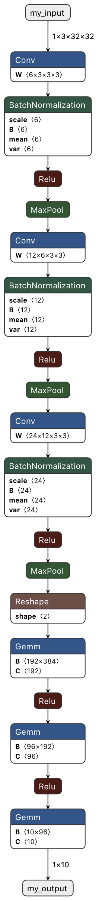

# Conversion from PyTorch to ONNX

The following code is pretty short, so I will not split it. The original code can be found in the file [step3.py](step3.py).

First, I instantiate my neural network and I load the weights, exactly as the [previous script](step2.md).

Second, I define a dummy input. This means I create a tensor having a size compatible with what the network is expecting. In my case, the network has been trained with mini-batches of size 10x3x32x32 (batch size, channels, height, width). I simply create here a random tensor of size 1x3x32x32 corresponding to a batch of 1 image.

Third, I define a name for the input and output nodes. In my case, I have 1 input (the image) and 1 output (array of 10 values). This is very important to give meaningful input / output names to the network nodes for later use. If done well, one would not need to know anything about the network to know how to use it.

Finally, I convert the PyTorch model into an ONNX model. Note that I pass the input / output names to the conversion function.

```python
import torch

from model import MyNet


# Create the model and load the weights
model = MyNet()
model.load_state_dict(torch.load('my_network.pth'))

# Create dummy input
dummy_input = torch.rand(1, 3, 32, 32)

# Define input / output names
input_names = ["my_input"]
output_names = ["my_output"]

# Convert the PyTorch model to ONNX
torch.onnx.export(model,
                  dummy_input,
                  "my_network.onnx",
                  verbose=True,
                  input_names=input_names,
                  output_names=output_names)
```

# Visualization using Netron

[Netron](https://github.com/lutzroeder/netron) is a viewer for neural network, deep learning and machine learning models, as described on the creator's github page. By opening the ONNX network in Netron, I obtain the following graph. The input and output nodes are properly named, the input and output sizes are displayed, and all layers' properties are displayed too. Pretty cool right?

