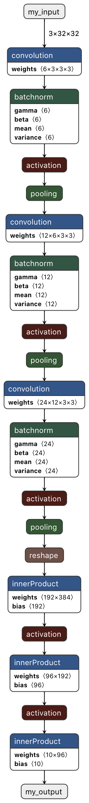

# Conversion from ONNX to CoreML


The conversion from ONNX to CoreML is, in this case, very simple. First I load the ONNX model as a CoreML model, and second I save this CoreML model on disk. The original code can be found in the file [step4_part1.py](step4_part1.py).

```python
from onnx_coreml import convert

# Load the ONNX model as a CoreML model
model = convert(model='my_network.onnx')

# Save the CoreML model
model.save('my_network.mlmodel')
```

# Visualization using Netron

As in the [previous script](step3.md), I use Netron to visualize my CoreML model. The input and output node are correctly named. But compared to [step 3](step3.md), there is no batch size (the input size is 3x32x32) and the layers' description are not as clear. However, a full description is provided by clicking on a given node in Netron. So, it's all good!

