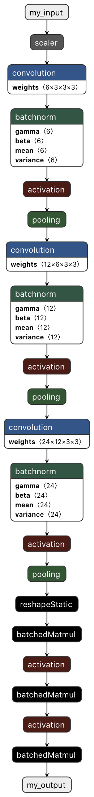

# Conversion from ONNX to CoreML


The conversion from ONNX to CoreML described here is slightly more complex than the one described in [step4](step4_part1.md).

First, I specify that `my_input` is an image using the `image_input_names` argument of the `convert` function. This allows to use in iOS the very common `CVPixelBuffer` and `CGImage` image types instead of the `MLMultiArray` type. Note that `image_input_names` works with multiple input images too. Similarly (but not used here) the `image_output_names` argument allows to specify which outputs are images.

Second, the argument `preprocessing_args={'image_scale': 1./255.}` indicates to the CoreML model that it must scale down the input image values by a factor 1/255 before sending them to the network. The conversion from a `uint8` (values in [0,255]) to `float32` (values in [0,1]) will be done directly by the network. This feature is extremly useful. Note that the argument `preprocessing_args` also allows to specify other operations such as bias. Note also that it is possible to specify post-processing operations to apply using the argument `deprocessing_args` if the considered CoreML model outputs one or several images of course.

Finally, I specify the minimum required iOS version since what is described here is not available on all iOS versions.

The original code can be found in the file [step5_part1.py](step5_part1.py).

```python
from onnx_coreml import convert

# Load the ONNX model as a CoreML model
model = convert(
    model='my_network.onnx',
    image_input_names=['my_input'],
    preprocessing_args={'image_scale': 1./255.},
    minimum_ios_deployment_target='13')

# Save the CoreML model
model.save('my_network_image.mlmodel')
```

In short, all the problem we had are solved using this solution:

- Use `CVPixelBuffer` or `CGImage` image format in iOS instead of `MLMultiArray` (see [here](step5_part2.md))
- No `uint8` to `float32` conversion needed anymore in both iOS and Python (see [here](step5_part3.md))
- No [0,255] to [0,1] value range conversion needed anymore in both iOS and Python (see [here](step5_part3.md))


# Visualization using Netron

Using Netron, one can see that the model is slightly different compared to one presented in [step 4](step4_part1.md).

- The input dimension is not displayed.
- The first node after the input image is a scaler node, which handles the values conversion described before.
- The rest of the network is pretty similar to the one in step 4, except for `reshape` node that became a `reshapeStatic` node, and for the `innerProduct` node that became a `batchMatmul` node. But I assume these nodes behave similarly.

