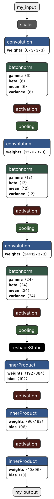

# Conversion from PyTorch to CoreML

The conversion using coremltools 4 is relatively straightforwad.

First, I trace the PyTorch model using a dummy input.

Second, I convert the trace using the `convert` function. The `ImageType` object passed as parameter allows me to define the input image name, its shape and the scaling to apply.

Third, I need to modify the output name since I could not do it at the conversion time. 

Finally, I save the model.

Remember that with coremltools 3, the input/output names were chosen at the PyTorch to ONNX conversion (cf. [step 3](step3.md)) and the scaling was defined at the ONNX to CoreML conversion (cf. [step 5 part 1](step5_part1.md)). With coremltools 4, well, it's a bit different.

The original code can be found in the file [step6_part1.py](step6_part1.py).

```python
import torch
import coremltools as ct

from model import MyNet

# Create the model and load the weights
model = MyNet()
model.load_state_dict(torch.load('my_network.pth'))

# Create dummy input
dummy_input = torch.rand(1, 3, 32, 32)

# Trace the model
traced_model = torch.jit.trace(model, dummy_input)

# Create the input image type
input_image = ct.ImageType(name="my_input", shape=(1, 3, 32, 32), scale=1/255)

# Convert the model
coreml_model = ct.convert(traced_model, inputs=[input_image])

# Modify the output's name to "my_output" in the spec
spec = coreml_model.get_spec()
ct.utils.rename_feature(spec, "81", "my_output")

# Re-create the model from the updated spec
coreml_model_updated = ct.models.MLModel(spec)

# Save the CoreML model
coreml_model_updated.save('my_network_image_ct4.mlmodel')
```


# Visualization using Netron

